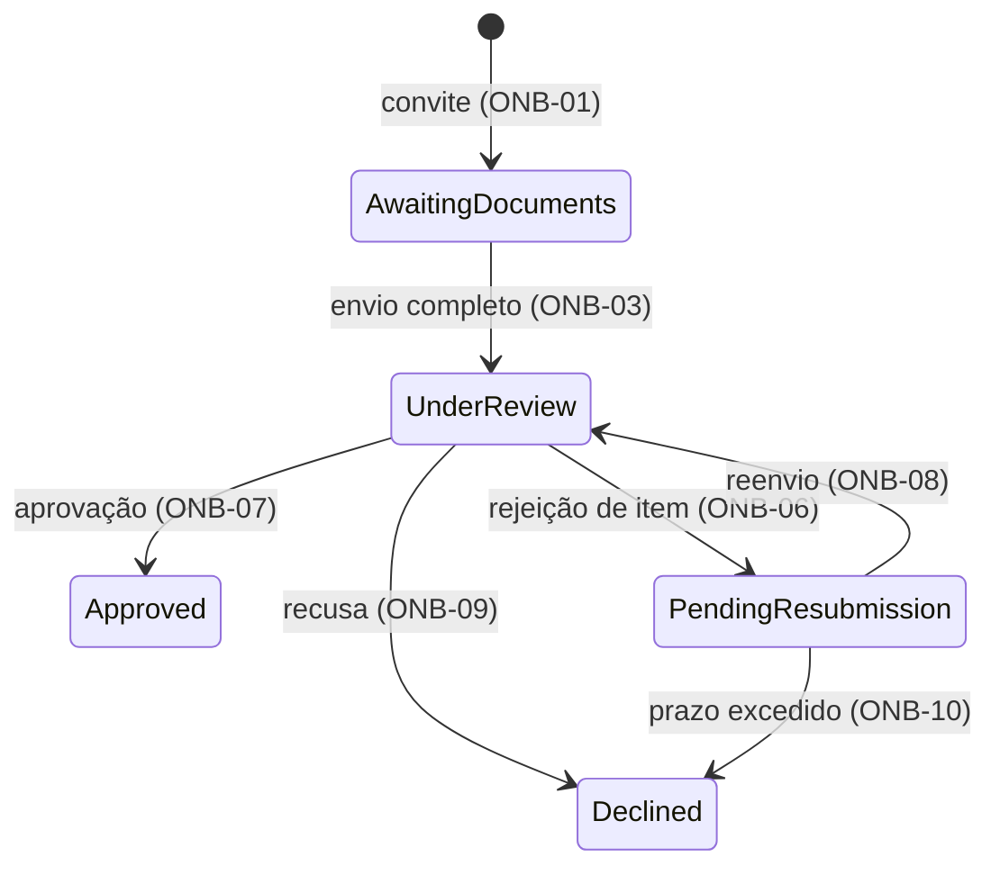

# Exemplo de PRD

PRD didático de um único contexto, sem PRD 0000. Números, atores e decisões são fictícios. Consulte a seção pertinente para entender a forma, sem copiar suas decisões. O exemplo não tem Regulatory Considerations para não apresentar alegações regulatórias como fatos verificados.

````markdown
# Verificação assíncrona de documentos

| | |
| --- | --- |
| **Originating Context** | CustomerOnboarding; affects AccountActivation |

Requirement prefix: `ONB`.

## Executive Summary

A operação precisa acompanhar documentos enviados para análise sem coordenar cada envio por e-mail. A proposta mantém um caso de verificação por cliente, com estado explícito e critérios para cada item. A elegibilidade para ativação depende do resultado do caso. [ASSUMPTION] O tempo de espera entre envios e análises é o principal componente do prazo atual; a medição ainda precisa confirmar essa hipótese.

## Context and Problem

Neste cenário fictício, a operação envia documentos em nome do cliente e acompanha a análise por mensagens. A aprovação não tem um registro único que os consumidores possam consultar. Não há baseline medido para estabelecer a meta de prazo.

## Target User / JTBD

- Analista de conformidade: validar cada documento contra um critério identificável e registrar o resultado.
- Operador de cadastro: saber o estado do caso e quais itens exigem reenvio.
- AccountActivation: consultar a elegibilidade do cliente sem interpretar mensagens.

## Proposed Solution

Um caso reúne os itens exigidos para o cliente e informa o resultado da verificação. A operação envia documentos; a análise aprova itens ou informa o motivo de rejeição. Os requisitos abaixo definem as transições.



| Estado | Identifier | Significado |
| --- | --- | --- |
| Aguardando documentos | `AwaitingDocuments` | Convite ativo com envio incompleto |
| Em análise | `UnderReview` | Caso disponível para análise |
| Aguardando reenvio | `PendingResubmission` | Há item rejeitado |
| Aprovado | `Approved` | Resultado terminal que permite ativação |
| Recusado | `Declined` | Resultado terminal de recusa ou expiração |

Armazenamento, notificações e desenho da interface serão definidos no trabalho técnico.

## Domain Glossary

| Termo | Definição |
| --- | --- |
| Caso de verificação | Itens exigidos de um cliente e seu estado de análise |
| Item | Documento com resultado próprio: pendente, aprovado ou rejeitado |
| Checklist | Critérios por tipo de cliente, com versão escolhida no convite (ONB-05) |
| Envio completo | Todos os itens do checklist têm documento anexado (ONB-03) |
| Elegibilidade | Resultado derivado do estado do caso (ONB-11) |

## Functional Requirements

- **ONB-01 (Must)** O caso começa em `AwaitingDocuments` a partir de um convite ativo.
- **ONB-02 (Must)** O operador pode enviar documentos em nome do cliente enquanto o convite estiver ativo, independentemente da disponibilidade do analista.
- **ONB-03 (Must)** O caso passa a `UnderReview` quando todos os itens exigidos têm documento anexado.
- **ONB-04 (Must)** O sistema rejeita imediatamente um item com formato ou tamanho incompatível com o checklist e informa o critério violado.
- **ONB-05 (Must)** A conformidade define e versiona o checklist por tipo de cliente; o caso usa a versão vigente no convite.
- **ONB-06 (Must)** Rejeitar um item exige um motivo previsto no checklist e leva o caso a `PendingResubmission`.
- **ONB-07 (Must)** Aprovar todos os itens leva o caso a `Approved`, que é terminal.
- **ONB-08 (Must)** Em `PendingResubmission`, somente itens rejeitados aceitam reenvio; um reenvio leva o caso a `UnderReview`, preservando os resultados dos demais itens.
- **ONB-09 (Must)** A conformidade pode recusar um caso em `UnderReview` com motivo registrado; `Declined` é terminal.
- **ONB-10 (Must)** Um caso em `PendingResubmission` há mais de 10 dias úteis passa a `Declined` com motivo de prazo excedido.
- **ONB-11 (Must)** A elegibilidade para ativação é verdadeira se, e somente se, o caso estiver em `Approved`.
- **ONB-12 (Must)** Cada envio, validação e transição registra responsável, instante e motivo, consultáveis por caso e cliente.

## Non-functional Requirements

- **ONB-NFR-01** Um envio completo deve ser refletido em `UnderReview` em até 1 minuto.
- **ONB-NFR-02** [GAP] A retenção dos documentos depende da política e das obrigações aplicáveis, ainda não identificadas neste exemplo.
- **ONB-NFR-03** Traces não contêm documentos nem dados pessoais; identificadores técnicos de caso e item são suficientes.

## Non-goals

- Envio direto pelo cliente nesta versão.
- Assinatura de contratos.
- Revisão do mérito dos critérios de conformidade.

## Declared Trade-offs

### Operação intermediando o envio (ONB-02)

*Cost:* mantém parte da carga manual.

*Reason:* permite avaliar o fluxo interno antes de abrir o envio ao cliente.

### Checklist atual preservado (ONB-05)

*Cost:* critérios legados de pouco valor podem continuar no processo.

*Reason:* rever seu mérito exige uma decisão de produto distinta.

### Prazo de reenvio de 10 dias úteis (ONB-10)

*Cost:* clientes mais lentos precisam de novo convite.

*Reason:* limita casos pendentes por tempo indefinido.

## Success Metrics

### Leading

- Taxa de reenvio por formato ou tamanho inválido (ONB-04): medir se o feedback no envio reduz retrabalho.

### Lagging

- Prazo entre envio completo e resultado terminal: medir baseline e distribuição antes de definir a meta.

### Guardrails

- Taxa de erros encontrados após a aprovação: a redução de prazo não pode comprometer a análise. [GAP] Limite ainda não definido.

## Acceptance Criteria

| Caso | Entrada | Condição intermediária | Requisito | Resultado |
| --- | --- | --- | --- | --- |
| Envio completo | Três itens válidos anexados às 10h | Checklist completo | ONB-03, ONB-NFR-01 | `UnderReview` até 10h01 |
| Formato inválido | Item 2 em formato não aceito | Critério de formato violado | ONB-04 | Item rejeitado com motivo; sem completar o checklist |
| Rejeição parcial | Itens 1 e 3 aprovados, item 2 rejeitado | Motivo registrado | ONB-06, ONB-08 | `PendingResubmission`; somente item 2 pode ser reenviado |
| Reenvio parcial | Itens 2 e 3 rejeitados; somente 2 reenviado | Item 3 ainda rejeitado | ONB-08 | `UnderReview`, preservando a rejeição do item 3 |
| Aprovação | Três itens aprovados | Nenhum item pendente | ONB-07, ONB-11 | `Approved`; elegibilidade verdadeira |
| Prazo excedido | Caso pendente por 11 dias úteis | Sem reenvio | ONB-10, ONB-11 | `Declined`; elegibilidade falsa |

## Dependencies and Risks

| Item | Tipo | Impacto |
| --- | --- | --- |
| Definição e versão do checklist | Dependência de produto | Sem critérios, a análise não pode começar |
| AccountActivation | Contexto consumidor | Precisa interpretar a elegibilidade conforme ONB-11 |
| Calendário de dias úteis | Definição pendente | Altera a expiração em ONB-10 |

## Open Questions

### [ASSUMPTION] O principal atraso está na espera entre envios e análise

**Premissa:** o tempo de espera, e não o de análise, domina o prazo atual.

**Impacto:** se a premissa for falsa, digitalizar o fluxo reduz pouco o prazo e a proposta perde sua justificativa.

**Responsável:** operação.

**Evidência necessária:** medição dos tempos de espera e de análise em casos reais antes de aprovar.

### [GAP] Calendário de dias úteis (ONB-10)

**Decisão pendente:** qual calendário define os dias úteis da expiração.

**Impacto:** determina quando um caso pendente passa a `Declined`.

**Responsável:** autor do produto.

### [GAP] Retenção de documentos (ONB-NFR-02)

**Decisão pendente:** quais política e obrigações definem a retenção.

**Impacto:** sem ela, o descarte de documentos não pode ser definido.

**Responsável:** conformidade.

## Weakest Point

**Decisão:** preservar o checklist atual sem revisar o mérito dos critérios (ONB-05).

**Risco:** exigências legadas podem continuar causando retrabalho sem melhorar a análise.

**Mitigação:** medir os motivos de reenvio desde o início do fluxo.

**Critério de reavaliação:** se a maior parte do retrabalho decorrer do mérito dos critérios, a decisão de adiar sua revisão precisa ser reavaliada.
````

## Exemplo de edição

Antes: “Deverá ser realizada a rejeição do item e a disponibilização da informação sobre o critério que foi violado.”

Depois: “O sistema rejeita o item e informa o critério violado.”

A edição preserva o resultado. Condições, instante e limites continuam definidos no requisito completo; a frase isolada não os substitui.
