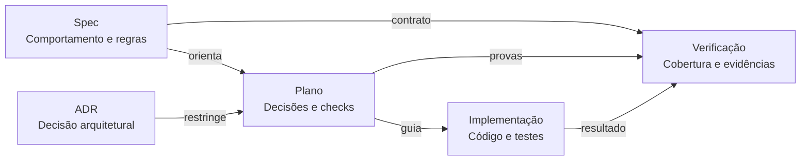
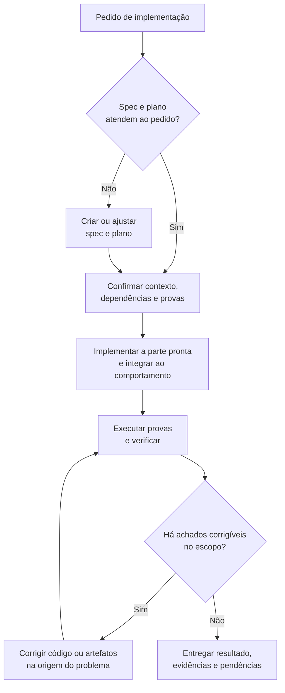

# sdd — Desenvolvimento por especificação

Use a skill `sdd` para especificar comportamentos completos, preparar uma mudança, implementar e verificar requisitos rastreáveis ou registrar uma decisão arquitetural em ADR. Ela continua sendo uma skill: o Claude Code executa o trabalho autorizado usando suas instruções. Este guia apresenta os pedidos e as entregas; as instruções do agente ficam em [SKILL.md](SKILL.md).

Cada spec nova descreve o menor fluxo que vai de um gatilho a um resultado observável pelo consumidor, com as regras e alternativas necessárias. Cancelar um pedido inclui confirmar ou recusar a solicitação e definir o estado final; gestão de pedidos pode agrupar esse comportamento com pagamento e entrega. Capability é um agrupamento opcional, e contratos existentes continuam como fontes vivas, sem uma spec nova por ticket.

## Começar

Com o plugin instalado, comece o pedido com `/ai-skills:sdd` na sessão do projeto consumidor; numa cópia avulsa da skill, use `/sdd`. O Claude Code também carrega a skill quando o pedido corresponde à descrição dela. Descreva o resultado desejado e indique os documentos ou caminhos que servem de entrada.

```text
/ai-skills:sdd Especifique o cancelamento de pedidos com base em
docs/product/orders.md e no comportamento existente em src/orders.
```

Forneça o que estiver disponível:

- O problema, quem observa o resultado e o comportamento esperado.
- Os caminhos de PRDs, tickets, specs, planos, ADRs ou código pertinentes.
- O recorte da mudança e as decisões de negócio já tomadas.
- As restrições técnicas e os comandos de validação conhecidos.

Você pode começar sem todos esses dados. A skill procura as informações nas fontes indicadas e pergunta sobre decisões que elas não resolvem. Consulte [premissas e lacunas](references/workflow.md#premissas-e-lacunas) para entender como o que ainda falta aparece nos artefatos.

## Escolher o resultado

| Pedido | Entradas úteis | Entrega esperada |
| --- | --- | --- |
| Especificar | Pedido de comportamento, material de produto ou código existente | Spec com regras de negócio, requisitos verificáveis e decisões ainda abertas |
| Planejar | Spec, código atingido, ADRs e restrições técnicas | Plano com escopo, decisões e checks; contexto e dependências por item quando necessários |
| Implementar | Mudança desejada ou spec e plano existentes | Código, provas executadas e artefatos atualizados |
| Verificar | Spec, plano e implementação | Relatório de conformidade, cobertura, checks executados e pendências |
| Registrar ADR | Decisão adotada ou escolha delegada, contexto e evidências | ADR com decisão, alternativas conhecidas e consequências |

Para code review sem spec, documentação geral ou ajustes mecânicos, faça o pedido diretamente ao agente.

## Como os artefatos se relacionam

As setas mostram quais informações orientam a solução e a verificação. O ADR participa quando há uma decisão arquitetural pertinente à mudança.



## Exemplos de uso

Adapte os caminhos ao projeto. Os exemplos abaixo usam o comportamento `cancel-order` e a mudança `customer-cancellation`. O layout pode agrupar esse comportamento em `docs/specs/order-management/cancel-order/`, sem ampliar a spec.

### Criar ou revisar uma spec

```text
/ai-skills:sdd Especifique o cancelamento de pedido, da solicitação do cliente
à confirmação ou recusa com o estado final. Use docs/product/orders.md
e src/orders como fontes.
```

```text
/ai-skills:sdd Atualize docs/specs/cancel-order/spec.md para permitir
o cancelamento de pedidos ainda não pagos. Preserve os demais contratos.
```

Para descrever o sistema atual a partir do código:

```text
/ai-skills:sdd Especifique o comportamento existente de cancelamento de pedido
a partir de src/orders e dos testes em tests/orders.
```

Consulte [especificação](references/specify.md) para os critérios do contrato e [exemplo de spec](references/spec-example.md) para um artefato ilustrativo.

### Criar um plano

```text
/ai-skills:sdd Planeje a implementação do cancelamento definido em
docs/specs/cancel-order/spec.md. Considere src/orders e os ADRs
vigentes. Produza apenas o plano.
```

O plano registra as escolhas da solução e as provas que devem passar. Para uma mudança simples, pode bastar o cabeçalho e Checks. Quando houver dependências ou passagem de trabalho, Execution organiza resultados implementáveis, contexto e referência às provas. Consulte [plano](references/plan.md) e [preparação](references/prepare.md).

```text
/ai-skills:sdd Prepare apenas o plano para implementar docs/specs/cancel-order/spec.md
em outra sessão. Confirme os contratos pertinentes e explicite as dependências
e o contexto necessário por item, sem implementar ainda.
```

### Implementar e verificar

```text
/ai-skills:sdd Implemente o cancelamento conforme
docs/specs/cancel-order/spec.md e
docs/specs/cancel-order/0001-customer-cancellation.md.
```

Você também pode pedir a implementação diretamente, descrevendo o comportamento desejado. A skill cria a spec e o plano que faltarem e segue até a verificação dentro do escopo autorizado. Consulte [execução](references/execute.md).



Quando uma decisão ou uma restrição impedir a conclusão de parte do escopo, essa pendência aparece na entrega, com seu impacto. O trabalho independente dela continua.

### Retomar uma mudança

```text
/ai-skills:sdd Retome a implementação de
docs/specs/cancel-order/0001-customer-cancellation.md. Confira a spec
atual e o diff existente e conclua os checks pendentes do escopo.
```

Indique os artefatos da mudança para que a retomada use o contrato, as decisões e as evidências já registrados. Consulte [retomar uma mudança](references/execute.md#retomar-uma-mudança).

### Verificar uma implementação

```text
/ai-skills:sdd Verifique a implementação contra
docs/specs/cancel-order/spec.md e
docs/specs/cancel-order/0001-customer-cancellation.md.
Entregue os achados e as evidências, sem aplicar correções.
```

O relatório normalmente aparece na resposta. Peça um arquivo quando precisar conservar essa entrega no projeto. Consulte [verificação](references/verify.md).

### Registrar uma decisão em ADR

```text
/ai-skills:sdd Registre em ADR a decisão já adotada de publicar eventos
de domínio por outbox. Use src/messaging, os testes e o histórico
do Git para identificar a escolha e as evidências disponíveis.
```

Para uma escolha ainda em aberto, peça a comparação das alternativas e informe se está delegando a decisão. Consulte [ADR](references/adr.md) para o registro de decisões novas ou existentes.

## Usar as entregas

Você pode pedir cada resultado separadamente ou solicitar a implementação completa. Um pedido apenas de spec ou plano entrega esse artefato.

As convenções do projeto consumidor determinam a organização dos arquivos. Consulte [artefatos e layout](references/workflow.md#artefatos-e-layout) para o layout usado quando o projeto não define outro. Os modelos ficam em [spec](assets/spec.md), [plano](assets/plan.md) e [ADR](assets/adr.md). Context e Requirements formam a base da spec; as demais seções entram quando acrescentam informação. A análise dos riscos continua, sem exigir um inventário de dimensões inaplicáveis no documento. O mapa Observable Decisions é preservado nas specs que já o usam e incluído em novas specs quando pedido.

Confira na resposta os caminhos dos artefatos, os resultados dos checks e as premissas ou lacunas ainda abertas. Consulte [entrega](references/deliver.md) para os registros esperados e [escopo e autorização](references/workflow.md#escopo-e-autorização) para os limites de cada pedido. Commit e push precisam de autorização explícita.

## Conferir a forma dos artefatos

A skill executa `check_spec.py` depois de criar ou alterar uma spec ou um plano. Para repetir essa conferência, execute na raiz do projeto consumidor:

```bash
python "<skill-dir>/scripts/check_spec.py" docs/specs
```

Substitua `<skill-dir>` pelo caminho absoluto da pasta do `SKILL.md` carregado e ajuste `docs/specs` à organização do projeto. O script exige Python 3.10+ e Git; no Windows, `py -3` pode substituir `python`.

A saída `0` confirma a forma dos artefatos. A conformidade do comportamento depende dos checks e da revisão. Consulte [conferir com o check_spec.py](references/workflow.md#conferir-com-o-check_specpy) para os resultados e limites dessa conferência.
