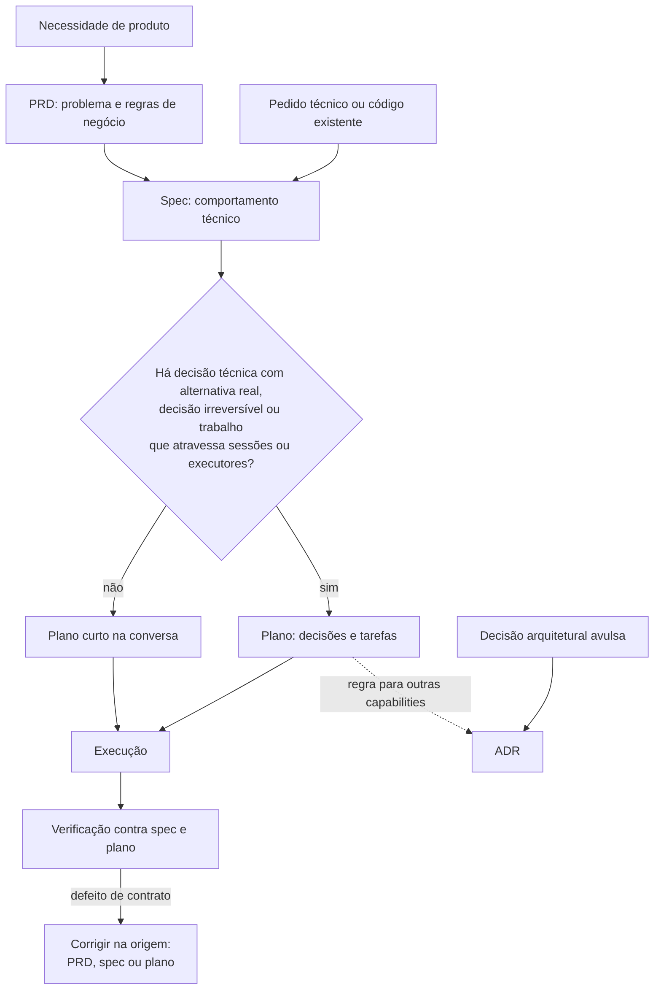

# Desenvolvimento por especificação

Converta uma necessidade em uma mudança verificável. O PRD define problema, comportamento e regras de negócio; a spec, o comportamento técnico; o plano, a solução e as tarefas.

```mermaid
flowchart TD
    Need[Necessidade de produto] --> PRD[PRD: problema e regras de negócio]
    PRD --> Spec[Spec: comportamento técnico]
    Source[Pedido técnico ou código existente] --> Spec
    Spec --> NeedPlan{Há decisão técnica com alternativa real,<br/>decisão irreversível ou trabalho<br/>que atravessa sessões ou executores?}
    NeedPlan -- sim --> Plan[Plano: decisões e tarefas]
    NeedPlan -- não --> Short[Plano curto na conversa]
    Plan -. regra para outras capabilities .-> ADR[ADR]
    Decision[Decisão arquitetural avulsa] --> ADR
    Plan --> Execute[Execução]
    Short --> Execute
    Execute --> Verify[Verificação contra spec e plano]
    Verify -- defeito de contrato --> Fix[Corrigir na origem:<br/>PRD, spec ou plano]
```

Uma mudança precisa de PRD quando muda o resultado, a informação ou o prazo que o consumidor observa. Refatoração interna, decisão arquitetural local e contrato de API sem contexto de produto começam pela spec. Uma decisão que vale para outras capabilities pode ir direto para o ADR.

## Escolher a etapa

Leia o [fluxo comum](references/workflow.md) e a referência da etapa solicitada. Carregue outras referências apenas quando forem pré-requisitos reais.

| Pedido | Referência | Resultado |
| --- | --- | --- |
| Escrever, editar ou revisar PRD, inclusive a visão geral de produto | [PRD](references/prd.md) | Problema, usuário, comportamento, requisitos verificáveis e custo das decisões |
| Especificar comportamento ou documentar módulo existente | [Especificação](references/specify.md) | Spec com critérios verificáveis |
| Planejar a solução e decompor o trabalho | [Plano e tarefas](references/tasks.md) | Decisões com custo e tarefas executáveis por dependência |
| Implementar spec ou funcionalidade não trivial | [Execução](references/execute.md) | Mudança implementada e verificada |
| Verificar implementação | [Verificação](references/verify.md) | Evidências de conformidade e lacunas |
| Retomar mudança | Seção Retomar uma mudança de [execução](references/execute.md) | Próxima etapa sustentada pelo estado atual |
| Registrar decisão arquitetural, avulsa ou durante o planejamento | [ADR](references/adr.md) | Decisão e consequências rastreáveis |
| Revisar spec, plano ou ADR | Referência da etapa do artefato | Achados com a regra violada |

Consulte [prosa](references/prose.md) sempre que escrever.

Os exemplos das referências são didáticos. Seus números, atores, interfaces, comandos e escolhas não se tornam fatos do projeto nem evidência executada.

Para uma correção localizada, leia o trecho e suas dependências em vez de reler todo o método, e preserve os requisitos e formatos existentes.
