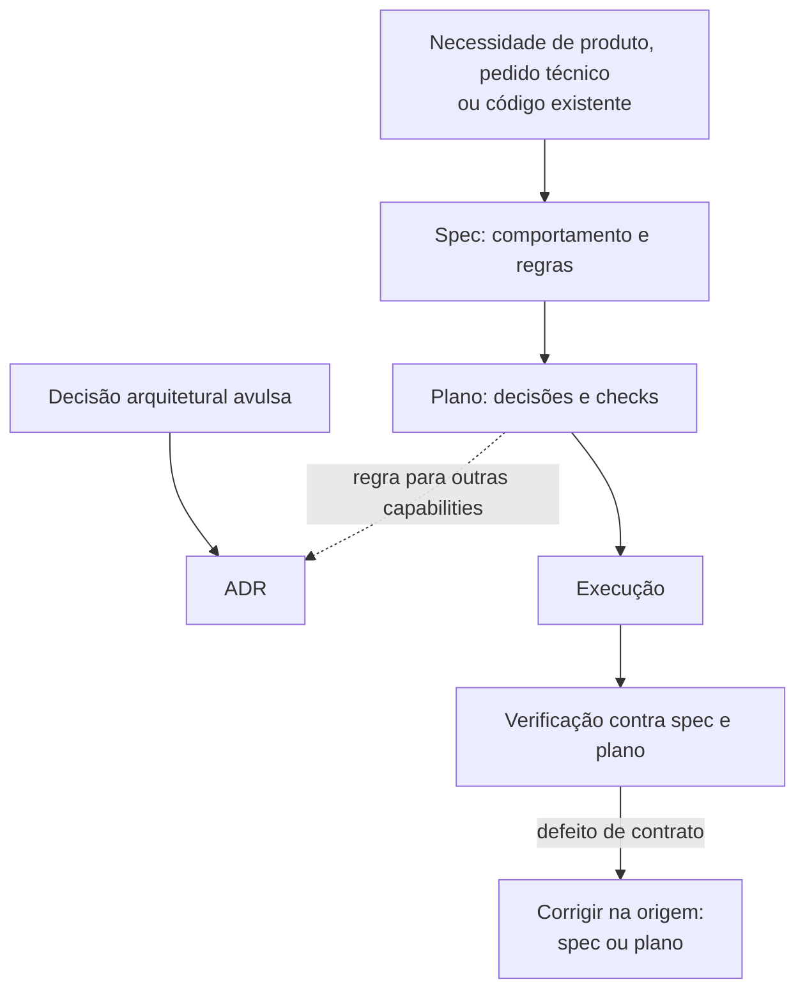

# Desenvolvimento por especificação

Converta uma necessidade em uma mudança verificável:

- A spec define o comportamento que o consumidor observa, inclusive as regras de negócio.
- O plano define as decisões técnicas e os checks que provam a mudança.
- O ADR registra uma decisão que vale para outras capabilities.

```mermaid
flowchart TD
    Source[Necessidade de produto, pedido técnico<br/>ou código existente] --> Spec[Spec: comportamento e regras]
    Spec --> Plan[Plano: decisões e checks]
    Plan -. regra para outras capabilities .-> ADR[ADR]
    Decision[Decisão arquitetural avulsa] --> ADR
    Plan --> Execute[Execução]
    Execute --> Verify[Verificação contra spec e plano]
    Verify -- defeito de contrato --> Fix[Corrigir na origem:<br/>spec ou plano]
```

## Termos

- **Consumidor**: quem observa o resultado de uma capability. Pode ser uma pessoa, outro sistema ou o código que a chama.
- **Mudança não trivial**: altera comportamento observável, dados persistidos ou um contrato que outro componente consome. Renomear, formatar ou ajustar texto sem efeito observável é trivial.

## Escolher as referências

Leia cada referência cuja condição vale para o pedido. Carregue as demais só quando forem pré-requisito real.

| Referência | Quando ler |
| --- | --- |
| [Fluxo comum](references/workflow.md) | Sempre, antes da referência da etapa |
| [Prosa](references/prose.md) | Ao escrever ou revisar qualquer artefato |
| [Especificação](references/specify.md) | Especificar comportamento, inclusive a partir de necessidade de produto; documentar módulo existente; revisar uma spec; implementar uma mudança que ainda não tem spec |
| [Exemplo de spec](references/spec-example.md) | Escrever uma spec nova, depois da especificação |
| [Plano](references/plan.md) | Planejar a solução; implementar uma mudança ainda sem plano; revisar um plano |
| [Execução](references/execute.md) | Implementar spec ou funcionalidade não trivial; retomar uma mudança |
| [Verificação](references/verify.md) | Verificar a implementação contra a spec e o plano |
| [ADR](references/adr.md) | Registrar uma decisão pedida como ADR ou encaminhada pelo plano; revisar um ADR |

## Limites

- Os exemplos das referências são didáticos. Números, atores, interfaces, comandos e escolhas deles não se tornam fatos do projeto nem evidência executada.
- Numa correção localizada, de artefato ou de código, leia o trecho e as dependências dele em vez de reler todas as referências. Preserve os requisitos e os formatos existentes.
