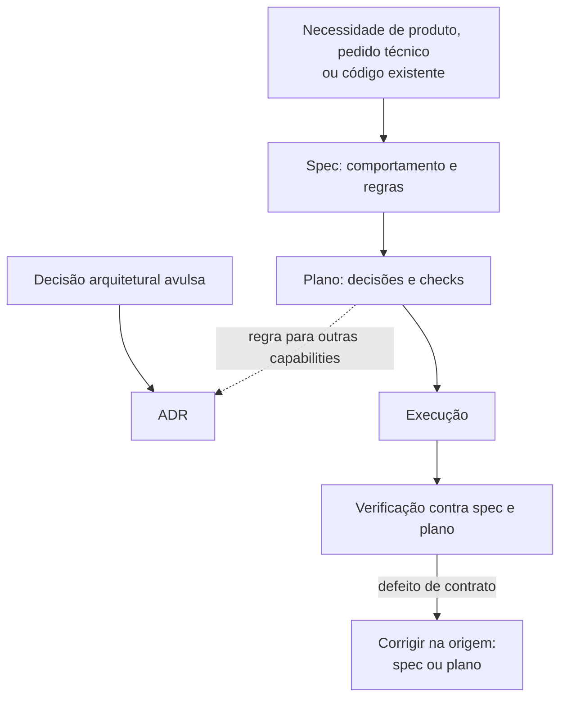

# Desenvolvimento por especificação

Converta uma necessidade em uma mudança verificável. A spec define o comportamento que o consumidor observa, inclusive as regras de negócio; o plano, as decisões técnicas e os checks que provam a mudança.

```mermaid
flowchart TD
    Source[Necessidade de produto, pedido técnico<br/>ou código existente] --> Spec[Spec: comportamento e regras]
    Spec --> Plan[Plano: decisões e checks]
    Plan -. regra para outras capabilities .-> ADR[ADR]
    Decision[Decisão arquitetural avulsa] --> ADR
    Plan --> Execute[Execução]
    Execute --> Verify[Verificação contra spec e plano]
    Verify -- defeito de contrato --> Fix[Corrigir na origem:<br/>spec ou plano]
```

## Escolher as referências

Leia cada referência cuja condição vale para o pedido. Carregue as demais apenas quando forem pré-requisitos reais.

| Referência | Quando ler |
| --- | --- |
| [Fluxo comum](references/workflow.md) | Sempre, antes da referência da etapa |
| [Prosa](references/prose.md) | Ao escrever ou revisar qualquer artefato |
| [Especificação](references/specify.md) | Especificar comportamento, inclusive a partir de necessidade de produto, documentar módulo existente ou revisar uma spec |
| [Plano](references/plan.md) | Planejar a solução, implementar uma mudança ainda sem plano ou revisar um plano |
| [Execução](references/execute.md) | Implementar spec ou funcionalidade não trivial, ou retomar uma mudança |
| [Verificação](references/verify.md) | Verificar a implementação contra a spec e o plano |
| [ADR](references/adr.md) | Registrar uma decisão pedida como ADR ou encaminhada pelo plano, ou revisar um ADR |

Os exemplos das referências são didáticos. Seus números, atores, interfaces, comandos e escolhas não se tornam fatos do projeto nem evidência executada.

Para uma correção localizada, leia o trecho e suas dependências em vez de reler todo o método, e preserve os requisitos e formatos existentes.
