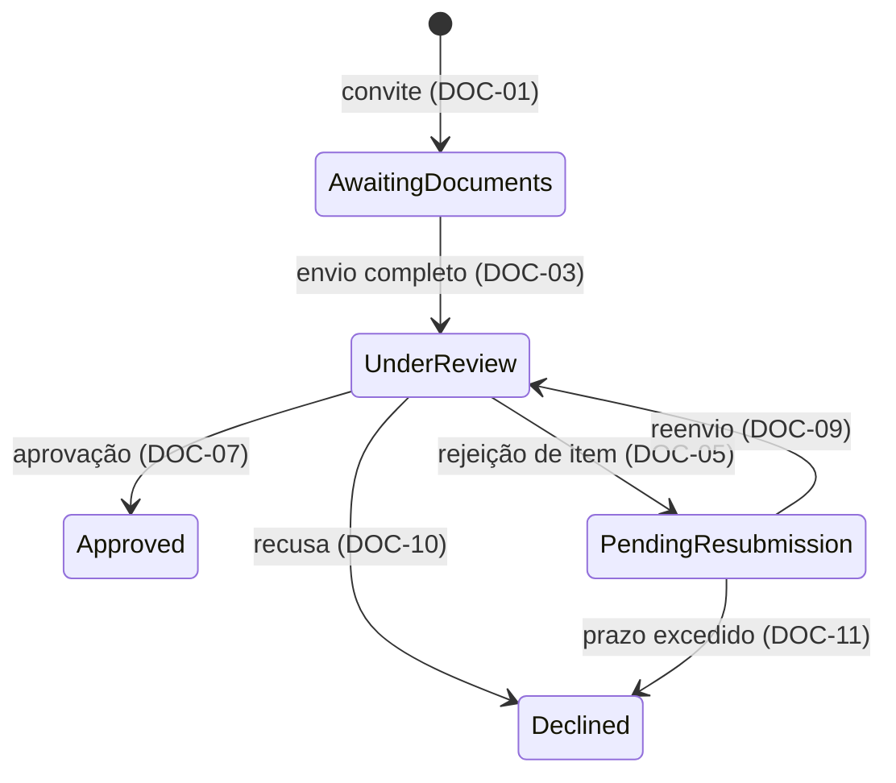

# Exemplo de spec

Conteúdo: Context · Scope · Assumptions · Gaps · Glossary · Requirements · Domain Events · Acceptance Scenarios · Observable Decisions · Trade-offs

Use este exemplo para entender como requisitos, premissas, lacunas e dimensões se relacionam. O cenário e as evidências são fictícios; ajuste o nível de detalhe ao contrato do projeto.

- Não tem References nem Divergences: usa fontes internas fictícias e não identifica diferenças entre implementação e intenção documentada.
- Observable Decisions cobre todas as dimensões: cada uma aponta para requisitos, garantias existentes, premissas ou lacunas, ou aparece na linha `n/a` com o motivo.
- A primeira premissa é uma inferência ainda não verificada. A segunda registra o comportamento provisório de uma lacuna e sustenta DOC-16, que muda quando a decisão for tomada.
- Acceptance Scenarios mostra combinações entre condições ou requisitos; casos cujo resultado já está inteiro num requisito ficam nos checks do plano.

````markdown
# Verificação de documentos

| | |
| --- | --- |
| **Requirement Prefix** | `DOC` |
| **Affected Capabilities** | Ativação de conta |

## Context

A operação envia documentos em nome do cliente e acompanha a análise por mensagens. A ativação de conta não tem onde consultar o resultado.

O analista de conformidade precisa validar cada documento contra um critério identificável. O operador precisa saber quais itens exigem reenvio, e a ativação precisa consultar a elegibilidade do cliente.

O contrato vem do pedido da operação e do checklist mantido pela conformidade. O checklist fixa o prazo de reenvio em 10 dias úteis, contados pelo calendário de expediente da operação. A API reutiliza o formato de erro definido pelo serviço fictício em `src/Api/Errors.cs:12`.

## Scope

Um caso de verificação por cliente, com estado explícito, critérios por item e resultado consultável pela ativação de conta. Ficam fora o envio direto pelo cliente, a assinatura de contratos e a revisão do mérito dos critérios do checklist.

## Assumptions

- **Um cliente tem no máximo um caso aberto.** O cadastro atual associa um convite ativo por cliente, mas a operação ainda precisa verificar se isso também limita os casos abertos. Se vários casos puderem coexistir, a elegibilidade (DOC-12) precisará dizer qual caso vale.
- **Decisões simultâneas sobre o mesmo item: vale a primeira.** A operação tem mais de um analista por turno, e dois podem abrir o mesmo caso. Enquanto a lacuna Política de decisões simultâneas sobre o mesmo item estiver aberta, a segunda decisão sobre um item já decidido é recusada (DOC-16), preservando o resultado vigente. Se a última decisão tiver de prevalecer, o primeiro analista precisará ser avisado da troca.

## Gaps

| Gap | Affects | Owner |
| --- | --- | --- |
| Política de decisões simultâneas sobre o mesmo item | DOC-16: recusa provisória da segunda decisão | Conformidade |
| Política de retenção de documentos | Por quanto tempo os documentos são mantidos; o requisito será escrito quando a decisão existir | Conformidade |
| Quem pode recusar um caso além da conformidade | DOC-10 | Conformidade |

## Glossary

| Term | Identifier | Definition |
| --- | --- | --- |
| Caso de verificação | `VerificationCase` | Itens exigidos de um cliente e o estado da análise |
| Item | `CaseItem` | Documento com resultado próprio: pendente, aprovado ou rejeitado |
| Checklist | `Checklist` | Critérios por tipo de cliente, com a versão fixada na abertura do caso (DOC-01) |
| Elegibilidade | `IsEligible` | Resultado derivado do estado do caso (DOC-12) |

## Requirements



| State | Identifier | Meaning |
| --- | --- | --- |
| Aguardando documentos | `AwaitingDocuments` | Convite ativo com envio incompleto |
| Em análise | `UnderReview` | Caso disponível para análise |
| Aguardando reenvio | `PendingResubmission` | Há item rejeitado |
| Aprovado | `Approved` | Resultado terminal que permite a ativação |
| Recusado | `Declined` | Resultado terminal de recusa ou expiração |

- **DOC-01** — QUANDO um convite for criado, ENTÃO o sistema DEVE abrir um caso em `AwaitingDocuments` com a versão vigente do checklist do tipo de cliente.
- **DOC-02** — ENQUANTO o convite estiver ativo, o sistema DEVE aceitar documentos enviados pelo operador em nome do cliente, independentemente da disponibilidade do analista.
- **DOC-03** — QUANDO todos os itens exigidos tiverem documento anexado, ENTÃO o sistema DEVE mover o caso para `UnderReview`.
- **DOC-04** — SE um documento tiver formato ou tamanho incompatível com o checklist, ENTÃO o sistema DEVE rejeitar o item no envio, informar o critério violado e manter os demais itens do caso.
- **DOC-05** — QUANDO o analista rejeitar um item com um motivo previsto no checklist, ENTÃO o sistema DEVE registrar o motivo e mover o caso para `PendingResubmission`.
- **DOC-06** — SE o analista rejeitar um item sem motivo previsto no checklist, ENTÃO o sistema DEVE recusar a operação e manter o estado do caso.
- **DOC-07** — QUANDO todos os itens estiverem aprovados, ENTÃO o sistema DEVE mover o caso para `Approved`, que é terminal.
- **DOC-08** — ENQUANTO o caso estiver em `PendingResubmission`, o sistema DEVE aceitar reenvio apenas dos itens rejeitados.
- **DOC-09** — QUANDO um item rejeitado for reenviado, ENTÃO o sistema DEVE mover o caso para `UnderReview` e preservar o resultado dos demais itens.
- **DOC-10** — QUANDO a conformidade recusar um caso em `UnderReview` com motivo registrado, ENTÃO o sistema DEVE movê-lo para `Declined`, que é terminal.
- **DOC-11** — QUANDO um caso completar 10 dias úteis em `PendingResubmission` sem reenvio, ENTÃO o sistema DEVE movê-lo para `Declined` com o motivo de prazo excedido.
- **DOC-12** — O sistema DEVE considerar o cliente elegível para ativação se, e somente se, o caso dele estiver em `Approved`.
- **DOC-13** — QUANDO ocorrer um envio, uma validação ou uma transição, ENTÃO o sistema DEVE registrar responsável, instante e motivo, consultáveis por caso e por cliente.
- **DOC-14** — O sistema DEVE registrar nos traces apenas identificadores técnicos de caso e item, sem conteúdo de documentos nem dados pessoais.
- **DOC-15** — QUANDO um caso chegar a `Approved` ou `Declined`, ENTÃO o sistema DEVE publicar `VerificationCaseConcluded`.
- **DOC-16** — SE um analista decidir um item que já recebeu decisão na mesma análise, ENTÃO o sistema DEVE recusar a decisão e informar o resultado vigente do item.

## Domain Events

| Event | Trigger | Content | Consumers |
| --- | --- | --- | --- |
| `VerificationCaseConcluded` | Caso chega a um estado terminal (DOC-15) | Caso, cliente, estado terminal e instante | Ativação de conta, que pode receber o evento repetido e descarta a repetição pelo caso |

## Acceptance Scenarios

| Scenario | Input | Condition | Requirements | Result |
| --- | --- | --- | --- | --- |
| Formato inválido | Item 2 em formato não aceito | Itens 1 e 3 já anexados; envio incompleto | DOC-03, DOC-04 | Item 2 rejeitado com o critério; itens 1 e 3 continuam anexados; caso continua em `AwaitingDocuments` |
| Rejeição parcial | Itens 1 e 3 aprovados, item 2 rejeitado com motivo previsto | Caso em `UnderReview` | DOC-05, DOC-08 | `PendingResubmission`; só o item 2 aceita reenvio |
| Reenvio parcial | Itens 2 e 3 rejeitados; só o item 2 reenviado | Item 3 ainda rejeitado | DOC-08, DOC-09 | `UnderReview`, com a rejeição do item 3 preservada |
| Aprovação | Três itens aprovados | Nenhum item pendente | DOC-07, DOC-12, DOC-15 | `Approved`; elegibilidade verdadeira; evento publicado |
| Prazo excedido | Caso pendente há 10 dias úteis | Nenhum reenvio | DOC-11, DOC-12 | `Declined` com motivo de prazo; elegibilidade falsa |

## Observable Decisions

| Surface or dimension | Landing |
| --- | --- |
| API de envio: formato do erro | DOC-04 e o formato de erro do serviço (`src/Api/Errors.cs:12`) |
| Validation and limits | DOC-04 |
| Failure and partial failure | DOC-04 |
| Idempotency and duplication | DOC-15 e Domain Events |
| Authorization | DOC-02, DOC-05, DOC-10 e a lacuna Quem pode recusar um caso além da conformidade |
| Rate limiting | Quota interna aplicada à API pelo serviço; excesso recusado antes de alterar o caso (`src/Api/RateLimit.cs:18`) |
| Concurrency and ordering | DOC-16 e a premissa **Decisões simultâneas sobre o mesmo item: vale a primeira.** |
| Data lifecycle | A lacuna Política de retenção de documentos |
| State transitions | DOC-01, DOC-03, DOC-05, DOC-07, DOC-09, DOC-10, DOC-11 e o diagrama |
| Observability | DOC-13 e DOC-14 |
| Cross-capability consistency | DOC-12 e DOC-15 |
| `n/a` | External dependency failure: a análise não chama serviço externo |

## Trade-offs

| Decision | Cost | Reason |
| --- | --- | --- |
| Operação intermedeia o envio (DOC-02) | Mantém parte da carga manual | Avaliar o fluxo interno antes de abrir o envio ao cliente |
| Prazo de reenvio de 10 dias úteis (DOC-11) | Clientes mais lentos precisam de novo convite | Evita casos pendentes por tempo indefinido |
````
