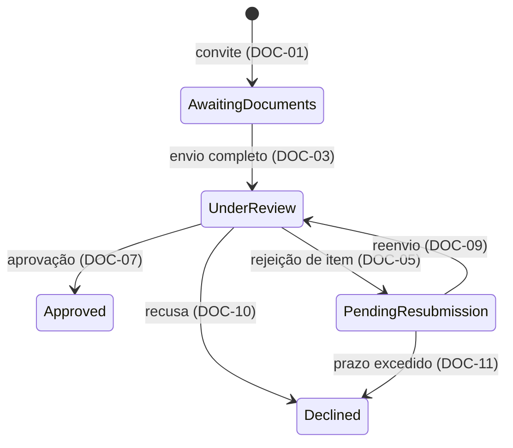

# Exemplo de spec

A spec de uma capability que nasceu de uma necessidade de produto, num cenário fictício. Ela não tem Referências nem Divergências, porque não consulta norma nem parte de código existente.

````markdown
# Verificação de documentos

| | |
| --- | --- |
| **Prefixo dos requisitos** | `DOC` |
| **Capabilities afetadas** | Ativação de conta |

## Contexto

A operação envia documentos em nome do cliente e acompanha a análise por mensagens, e a ativação de conta não tem onde consultar o resultado. O analista de conformidade precisa validar cada documento contra um critério identificável, o operador precisa saber quais itens exigem reenvio, e a ativação precisa da elegibilidade do cliente sem interpretar mensagens. O contrato vem do pedido da operação e do checklist mantido pela conformidade.

## Escopo

Um caso de verificação por cliente, com estado explícito, critérios por item e resultado consultável pela ativação de conta. Ficam fora o envio direto pelo cliente, a assinatura de contratos e a revisão do mérito dos critérios do checklist.

## Premissas

- **Um cliente tem no máximo um caso aberto.** Inferida do cadastro atual, que associa um convite ativo por cliente. Se for falsa, a elegibilidade (DOC-12) precisa dizer qual caso vale. Escolha: um caso aberto por cliente; um novo convite exige que o anterior tenha chegado a um estado terminal. Confirmada? n

## Lacunas

| Lacuna | Afeta | Responsável |
| --- | --- | --- |
| Calendário de dias úteis da expiração | DOC-11: quando um caso pendente passa a `Declined` | Operação |
| Política de retenção de documentos | Por quanto tempo os documentos são mantidos; o requisito será escrito quando a decisão existir | Conformidade |
| Quem pode recusar um caso além da conformidade | DOC-10 | Conformidade |

## Glossário

| Termo | Identificador | Definição |
| --- | --- | --- |
| Caso de verificação | `VerificationCase` | Itens exigidos de um cliente e o estado da análise |
| Item | `CaseItem` | Documento com resultado próprio: pendente, aprovado ou rejeitado |
| Checklist | `Checklist` | Critérios por tipo de cliente, com a versão fixada na abertura do caso (DOC-01) |
| Elegibilidade | `IsEligible` | Resultado derivado do estado do caso (DOC-12) |

## Requisitos



| Estado | Identificador | Significado |
| --- | --- | --- |
| Aguardando documentos | `AwaitingDocuments` | Convite ativo com envio incompleto |
| Em análise | `UnderReview` | Caso disponível para análise |
| Aguardando reenvio | `PendingResubmission` | Há item rejeitado |
| Aprovado | `Approved` | Resultado terminal que permite a ativação |
| Recusado | `Declined` | Resultado terminal de recusa ou expiração |

- **DOC-01** — QUANDO um convite for criado, ENTÃO o sistema DEVE abrir um caso em `AwaitingDocuments` com a versão vigente do checklist do tipo de cliente.
- **DOC-02** — ENQUANTO o convite estiver ativo, o sistema DEVE aceitar documentos enviados pelo operador em nome do cliente, independentemente da disponibilidade do analista.
- **DOC-03** — QUANDO todos os itens exigidos tiverem documento anexado, ENTÃO o sistema DEVE mover o caso para `UnderReview` em até 1 minuto.
- **DOC-04** — SE um documento tiver formato ou tamanho incompatível com o checklist, ENTÃO o sistema DEVE rejeitar o item no envio e informar o critério violado.
- **DOC-05** — QUANDO o analista rejeitar um item com um motivo previsto no checklist, ENTÃO o sistema DEVE registrar o motivo e mover o caso para `PendingResubmission`.
- **DOC-06** — SE o analista rejeitar um item sem motivo previsto no checklist, ENTÃO o sistema DEVE recusar a operação e manter o estado do caso.
- **DOC-07** — QUANDO todos os itens estiverem aprovados, ENTÃO o sistema DEVE mover o caso para `Approved`, que é terminal.
- **DOC-08** — ENQUANTO o caso estiver em `PendingResubmission`, o sistema DEVE aceitar reenvio apenas dos itens rejeitados.
- **DOC-09** — QUANDO um item rejeitado for reenviado, ENTÃO o sistema DEVE mover o caso para `UnderReview` e preservar o resultado dos demais itens.
- **DOC-10** — QUANDO a conformidade recusar um caso em `UnderReview` com motivo registrado, ENTÃO o sistema DEVE movê-lo para `Declined`, que é terminal.
- **DOC-11** — QUANDO um caso completar 10 dias úteis em `PendingResubmission` sem reenvio, ENTÃO o sistema DEVE movê-lo para `Declined` com o motivo de prazo excedido.
- **DOC-12** — O sistema DEVE considerar o cliente elegível para ativação se, e somente se, o caso dele estiver em `Approved`.
- **DOC-13** — QUANDO ocorrer um envio, uma validação ou uma transição, ENTÃO o sistema DEVE registrar responsável, instante e motivo, consultáveis por caso e por cliente.
- **DOC-14** — O sistema DEVE registrar nos traces apenas identificadores técnicos de caso e item, sem conteúdo de documentos nem dados pessoais.
- **DOC-15** — QUANDO um caso chegar a `Approved` ou `Declined`, ENTÃO o sistema DEVE publicar `VerificationCaseConcluded`.

## Eventos de domínio

| Evento | Gatilho | Conteúdo | Consumidores |
| --- | --- | --- | --- |
| `VerificationCaseConcluded` | Caso chega a um estado terminal (DOC-15) | Caso, cliente, estado terminal e instante | Ativação de conta, que pode receber o evento repetido e descarta a repetição pelo caso |

## Cenários de aceitação

| Cenário | Entrada | Condição | Requisitos | Resultado |
| --- | --- | --- | --- | --- |
| Envio completo | Três itens válidos anexados às 10h | Checklist completo | DOC-03 | `UnderReview` até 10h01 |
| Formato inválido | Item 2 em formato não aceito | Critério de formato violado | DOC-04 | Item rejeitado com o critério; caso continua em `AwaitingDocuments` |
| Rejeição parcial | Itens 1 e 3 aprovados, item 2 rejeitado com motivo previsto | Caso em `UnderReview` | DOC-05, DOC-08 | `PendingResubmission`; só o item 2 aceita reenvio |
| Rejeição sem motivo | Item 2 rejeitado sem motivo previsto | Caso em `UnderReview` | DOC-06 | Operação recusada; caso continua em `UnderReview` |
| Reenvio parcial | Itens 2 e 3 rejeitados; só o item 2 reenviado | Item 3 ainda rejeitado | DOC-09 | `UnderReview`, com a rejeição do item 3 preservada |
| Aprovação | Três itens aprovados | Nenhum item pendente | DOC-07, DOC-12, DOC-15 | `Approved`; elegibilidade verdadeira; evento publicado |
| Prazo excedido | Caso pendente há 10 dias úteis | Nenhum reenvio | DOC-11, DOC-12 | `Declined` com motivo de prazo; elegibilidade falsa |

## Decisões observáveis

| Superfície ou dimensão | Aterrissagem |
| --- | --- |
| API de envio: formato do erro | DOC-04; o corpo segue o formato de erro do serviço (`src/Api/Errors.cs:12`) |
| Transições de estado | DOC-01, DOC-03, DOC-05, DOC-07, DOC-09, DOC-10, DOC-11 e o diagrama |
| Idempotência e duplicação | DOC-15; o consumidor descarta a repetição pelo caso |
| Observabilidade | DOC-13 e DOC-14 |
| Ciclo de vida dos dados | Lacuna da política de retenção |
| `n/a` | Limite de taxa: uso interno pela operação; tela: a interface fica com o time de backoffice |

## Trade-offs

| Decisão | Custo | Motivo |
| --- | --- | --- |
| Operação intermedeia o envio (DOC-02) | Mantém parte da carga manual | Avaliar o fluxo interno antes de abrir o envio ao cliente |
| Prazo de reenvio de 10 dias úteis (DOC-11) | Clientes mais lentos precisam de novo convite | Evita casos pendentes por tempo indefinido |
````
