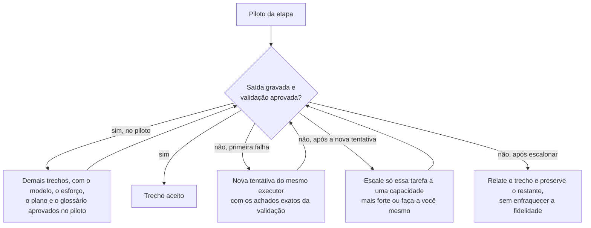

# Orquestração

## Papéis e capacidade

| Papel | Responsabilidade |
|---|---|
| Coordenador | Escopo, plano, conciliação do glossário, revisão do piloto, escalonamento e aceitação final |
| Executor | Extração de candidatos ou correção fiel de um trecho, sob contrato fixo |
| Executor de escalonamento | Reparar a tarefa em que o executor falhou, sem refazer trechos aprovados |

### Escolher os modelos

Escolha modelos e parâmetros durante a execução, conforme a interface de colaboração disponível na sessão e a preferência explícita do usuário. O coordenador planeja e revisa. Para os executores, escolha o modelo mais leve disponível; ele só recebe o restante dos trechos depois de passar pelo piloto.

- Não presuma que toda versão do Claude Code oferece a mesma API.
- Não troque o modelo da sessão nem alegue troca de modelo, contexto novo ou isolamento que não ocorreram.
- Executores não lançam outros subagentes, ainda que a plataforma permita: toda distribuição parte do coordenador.
- Sem informação de preço, não alegue economia medida.

### Exemplo de chamada

Quando a ferramenta disponível for `Agent` e expuser estes parâmetros, uma chamada independente pode usar:

```json
{
  "description": "corrigir trecho 03",
  "prompt": "<prompt autocontido com etapa, caminhos absolutos, contrato e saída>",
  "subagent_type": "<tipo com leitura e escrita de arquivos>",
  "model": "<modelo aceito pela interface>"
}
```

Escolha um `subagent_type` que comece com contexto próprio: um fork herda a conversa inteira e desfaz o isolamento que este fluxo exige. Os nomes e parâmetros aceitos vêm da interface efetivamente disponível; não trate este exemplo como contrato universal. Se não houver delegação disponível, aplique a seção Sem subagentes.

## Plano da execução

Antes de distribuir, grave `work/<run>/plan.json` com:

- fonte e manifesto;
- palestrante e domínio, quando conhecidos;
- os IDs efetivos de modelo e os níveis de esforço de cada papel, conforme retornados ou aceitos pela interface, com a justificativa;
- cópias do glossário e recibo de consolidação;
- o ID do piloto;
- por trecho: entradas, saídas, exceções contextuais, estado e tentativas.

O plano registra a execução; ele não é configuração reutilizável. Ao retomar, valide os arquivos antes de confiar no estado registrado.

## Contrato de cada tarefa

O prompt de cada executor é sempre autocontido e traz:

- a etapa e o ID do trecho, com caminhos absolutos de entrada e as saídas exclusivas;
- o prompt de `references/` preenchido, com metadados da fonte e o caminho do glossário imutável;
- o formato da saída e os critérios de aceitação;
- os limites: contexto só para leitura, sem editar fonte, glossário, plano ou outros trechos;
- o retorno esperado: resumo curto do resultado ou bloqueio específico.

Não copie esta conversa para o prompt. Quando a interface suportar isolamento de contexto, habilite-o; quando não suportar, limite explicitamente o executor aos arquivos e instruções do contrato.

Crie as pastas de saída antes de distribuir. Lance tarefas independentes em paralelo somente dentro da capacidade disponível e acompanhe cada ID retornado.

Antes de reatribuir a saída de uma tarefa, aguarde a conclusão e confirme o término, ou interrompa a tarefa anterior. Nunca deixe duas tentativas escreverem no mesmo caminho.

## Piloto, aceitação e novas tentativas

Cada etapa começa por um piloto num trecho difícil e representativo, e cada trecho segue este ciclo:



**Piloto de extração.** Confira formato, graus de evidência e uma amostra curta da fonte.

**Piloto de correção.** Depois de conciliar o glossário, repita no mesmo trecho e exija sequência de horários preservada, nenhuma omissão ou invenção, incertezas marcadas corretamente e registro de alterações válido. Aprovar a extração não aprova a correção.

Trocar o modelo, o nível de esforço, o plano ou o glossário para distribuir novas tarefas exige um novo piloto aceito. Escalar uma tarefa isolada não exige.

Executor que não gravou a saída não concluiu a tarefa, mesmo que tenha respondido. Depois de cada etapa, confira todos os trechos do manifesto e espere todas as saídas antes de consolidar o glossário ou reunir o texto.

Quando as falhas indicarem que os trechos são grandes demais, como cortes recorrentes, não divida um trecho isolado: gere um novo manifesto com `--words` menor numa nova pasta `work/<run>`, para não misturar saídas.

Revise a fidelidade dos trechos sinalizados e de uma pequena amostra dos aprovados. Amplie a revisão só quando as falhas indicarem um problema mais amplo. Os relatórios provam integridade estrutural; terminologia e sentido são responsabilidade do coordenador.

## Sem subagentes

Aplique os mesmos prompts você mesmo, um trecho por vez, com os mesmos contratos de arquivos, o glossário imutável por etapa, o piloto por etapa, os relatórios e a validação final.
